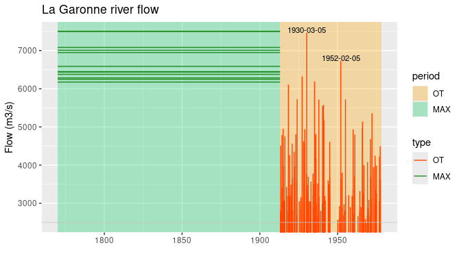
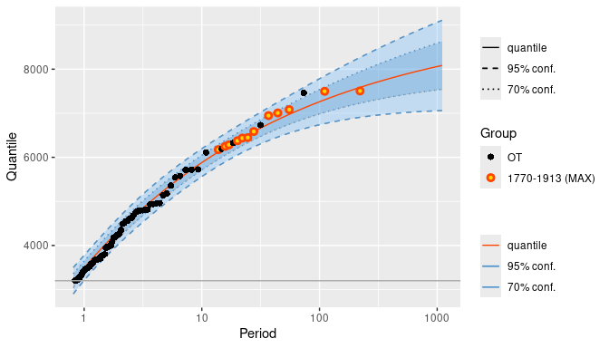
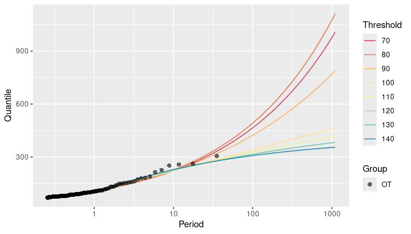
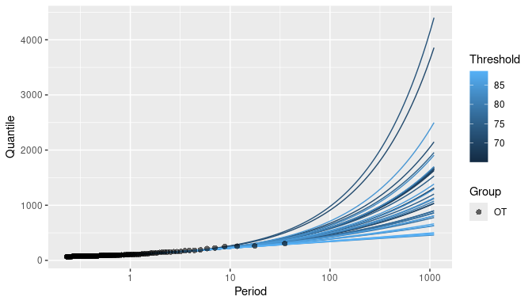
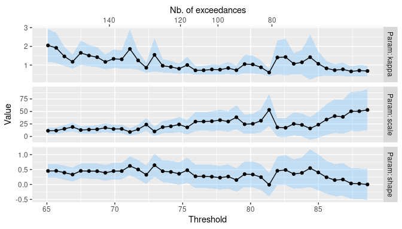

R package Renextra
================

<!-- badges: start -->

[](https://github.com/yvesdeville/nieve/actions/workflows/check.yml)
<!-- badges: end -->

## Goals

The **Renextra** R package has been financed by IRSN Behrig. It aims at
enhancing the **Renext** package which is available [on
CRAN](https://cran.r-project.org/web/packages/Renext/index.html) and on
the [IRSN GitHub](https://github.com/IRSN/Renext) public repos.

The present features of **Renextra** are

- Enhanced graphics relying on the **ggplot2** package. The `autoplot`
  method and (to a lesser extend) `autolayer` method can be used to get
  standard plots as used in Peaks Over Threshold analyses, such as the
  return-level plot.

- S3 class `RenouvTList` for threshold choice and so-called *threshold
  stability plot*.

- Experimental implementation of the Extended Generalized Pareto
  Distribution EGPD3 of Papatatopoulos and Tawn (2013).

Note that the use of the `EGPD3` distribution relies on the the general
features of the **Renext** package, in which the distribution of the
excesses over the threshold can be quite arbitrary. So, some initial
values of the parameters must be given. The estimated values of the
`scale` and `shape` parameters obtained by using the `"GPD"`
distribution can be used along with `kappa = 1.0`, see the examples.

## Installing

Provided that the **remotes** package is installed, the installation of
**Renextra** using the giHub source can be obtained by

``` r
library(remotes)
install_github("https://github.com/IRSN/Renextra")
```

You can also select a specific branch or a specific commit by using the
suitable syntax for `install_github`, see the **remotes** package
documentation.

The package should soon be available in pre-compiled form (including  
`.zip` a file for Windows) the **Releases** section.

## Examples

### Garonne (Jitterized)

The `GaronneJit` data object is a `Rendata` object derived from the
`Renouv` object**Renext** by jitterizing the observations

``` r
library(Renextra)
class(GaronneJit)
#> [1] "Rendata"
autoplot(GaronneJit)
```

<!-- -->

The object has class `"Rendata"` and describes both so-called
*systematic* and *historical* observations. An `autoplot` method is made
available for this class by **Renextra**.

When the object is used as the first argument of `Renouv` all the
observations are used in the fit. **Renextra** adds an `autoplot` method
for the `"Renouv"` class, producting a ggplot

``` r
fitGJ <- Renouv(GaronneJit, threshold = 3200, distname.y = "GPD", plot = FALSE)
autoplot(fitGJ)
```

<!-- -->

### Nidd River

The Nidd river example has been used in Davison and Smith (1990). The
data are provided by the **mev** package. We fit using a standard
Generalized Pareto for the excesses and then using an Exendended
Generalized Pareto as in Papastathopoulos and Tawn (1013).

``` r
 library(mev)
 fit <- RenouvTList(nidd,
                    effDuration = 35,
                    threshold = seq(from =70, to = 140, by = 10),
                    distname.y = "GPD")
 summary(fit)
#> RenouvTList object
#> o Estimated coefficients
#>         lambda         scale ind        shape         
#> u =  70  3.943 [0.336] -0.989 [10.104]   0.323 [0.114]
#> u =  80  2.457 [0.265] -2.213 [16.772]   0.343 [0.164]
#> u =  90  1.629 [0.216] 12.104 [24.891]   0.238 [0.204]
#> u = 100  1.114 [0.178] 50.288 [33.156]   0.003 [0.214]
#> u = 110  0.886 [0.159] 64.108 [41.456]  -0.070 [0.240]
#> u = 120  0.686 [0.140] 101.478 [49.078] -0.249 [0.238]
#> u = 130  0.629 [0.134] 77.930 [57.890]  -0.142 [0.294]
#> u = 140  0.514 [0.121] 98.568 [69.280]  -0.236 [0.322]
#> o Kolmogorov-Smirnov test
#>           n      D p.value
#> u =  70 138 0.0749  0.4205
#> u =  80  86 0.0536  0.9546
#> u =  90  57 0.0750  0.8821
#> u = 100  39 0.1014  0.7799
#> u = 110  31 0.0986  0.8951
#> u = 120  24 0.1075  0.9166
#> u = 130  22 0.1142  0.9057
#> u = 140  18 0.1406  0.8217
 autoplot(fit, show = list(quant = TRUE, allObs= TRUE))
```

<!-- -->

``` r
 ## Threshold Stability with ECGPD3
 fitE <- RenouvTList(nidd,
                     effDuration = 35,
                     threshold = seq(from = 65.08, to = 88.61, len = 40),
                     start.par.y = c(scale = 30, shape = 0.0, kappa = 1.0),
                     distname.y = "EGPD3")
 autoplot(fitE, show = list(quant = TRUE, allObs= TRUE))
```

<!-- -->

Note that since a large number of thresholds have been used the color
scale is continuous rather than discrete as before.

By autoplotting the coefficients of a `RenouvTList` object we get hints
on the threshold stability, especially regarding the shape coefficient.

``` r
 autoplot(coef(fitE, lambda = FALSE, sd = TRUE))
#> Warning in regularize.values(x, y, ties, missing(ties), na.rm = na.rm):
#> suppression des ex-aequos de 'x'
```

<!-- -->

## References

Davison A.C. and Smith R.L. (1990) “Models for Exceedances over High
Thresholds” *J.R. Statist. Soc. B* (**52**) pp. 393-442,
[doi](https://doi.org/10.1111/j.2517-6161.1990.tb01796.x).

Papastathopoulos I. and Tawn J.A. (2013) “Extended Generalized Pareto
Models for Tail Estimation”, *Journal of Statistical Planning and
Inference* (**143**), pp. 131-143,
[doi](https://doi.org/10.1016/j.jspi.2012.07.001).
